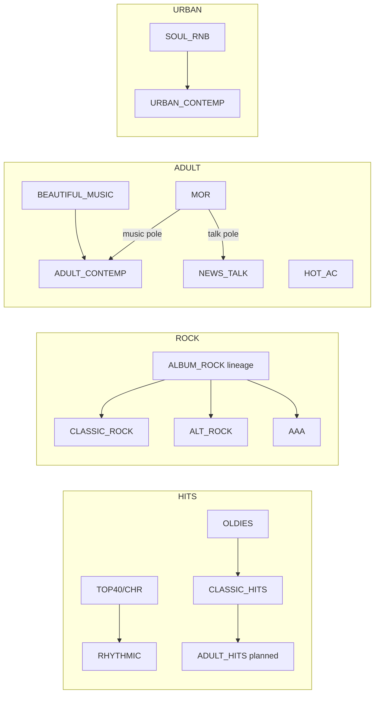

# Format Family Architecture — Canonical Spec (v1)

**Status:** Architecture / spec only — **no gameplay wiring**  
**Scope:** 1970–2026+ radio format taxonomy for Airwave Empire (Frequencies)  
**Audience:** Engineering, ecology tuning, diagnostics, future format expansion  

**Related documents:**

- **[data/formatFamilies.v1.json](../data/formatFamilies.v1.json)** — machine-readable family registry (Phase 0)
- **`npm run lint:format-families`** — verifies registry vs `FM{}`, `DRIFT{}`, `FORMAT_SUNSET`, lifecycle catalog
- [FORMAT_LIFECYCLE_LAYER_V1.md](./FORMAT_LIFECYCLE_LAYER_V1.md) — three-layer lifecycle model (national × market × era)
- [MARKET_ECOLOGY_MIGRATION_PLAN.md](./MARKET_ECOLOGY_MIGRATION_PLAN.md) — trait consumption and phased ecology rollout
- [MARKET_DATA_SCHEMA.md](./MARKET_DATA_SCHEMA.md) — market row schema

**Explicit non-goals (this document):**

- Renaming `FM{}` keys or save fields
- Changing `appl()`, ratings, revenue, AI reformat behavior, or player format picker
- Implementing new playable formats (except as *planned* IDs in tables)

---

## 1. Purpose and principles

### 1.1 Why format families

The simulation currently encodes formats as **flat string IDs** (`station.format`) with behavior scattered across:

- `FM{}` — unlock year, labels, CPM, spot load, public/institutional flags
- `DRIFT{}` — bipolar positioning sliders and era inflections
- `FORMAT_SUNSET` — gameplay viability curves in `appl()`
- `hitsLineage*` — unified Top 40 / CHR display and era pressure
- `formatLifecycle.v1.json` — diagnostic national curves (not loaded by gameplay)
- Ecology traits, regression harnesses, and logo template families (separate ad-hoc groupings)

**Format families** introduce a stable middle layer:

| Layer | Role |
|-------|------|
| **Family** | Lifecycle lane, ecology buckets, AI strategy, compatibility clusters |
| **Format (logical)** | Industry/Nielsen-facing name; may share one legacy ID with era-varying display |
| **Legacy ID** | Immutable `FM{}` / save key until a deliberate migration phase |

### 1.2 Design rules

1. **1970-first** — Every family must have a credible 1970 (or earlier emergence) story; later formats are unlocks or successors, not retroactive rewrites.
2. **Families organize behavior; formats sell the fantasy** — Players and rivals still pick concrete formats; families tune priors and AI, not replace IDs.
3. **Lifecycle is a prior, not a forced flip** — National decline, MOR sunset, and Oldies aging inform pressure; station-level drift and reformats remain player/AI outcomes.
4. **No save-schema change in Phase 0–2** — Families are derived from `format` + `year` (+ optional diagnostic tags).
5. **Institutional ≠ commercial Christian** — `RELIGIOUS_NETWORK` is not Gospel and not the proposed commercial **Christian** umbrella.

---

## 2. Canonical format families

### 2.1 Family registry

| Family ID | Permanent | Competitive (ratings) | Notes |
|-----------|-----------|----------------------|--------|
| `HITS` | — | Yes | CHR lane fragmentation |
| `ROCK` | — | Yes | Single lineage, era display labels |
| `ADULT` | — | Yes | AC / MOR / easy listening cluster |
| `COUNTRY` | — | Yes | |
| `URBAN` | — | Yes | Hip-hop may stay UC slider until Phase 4 |
| `SPOKEN` | — | Yes | Includes all-news |
| `CHRISTIAN` | — | Yes (commercial) | Gospel + future Christian |
| `SPANISH` | **Yes** | Yes | Phase 1 umbrella → future splits |
| `PUBLIC` | **Yes** | No (NCE) | Rival / institutional only |
| `REMNANT` | — | **No** | Brokered inventory; meta family |
| `INSTITUTIONAL` | **Yes** | No | Religious network; parallel to PUBLIC |

### 2.2 Formats per family (logical taxonomy)

#### HITS

| Logical format | Legacy ID (today) | Player selectable |
|----------------|-------------------|-------------------|
| Top 40 / CHR | `TOP40` (save alias `CHR` → migrated to `TOP40`) | Yes |
| Rhythmic CHR | `RHYTHMIC` | Yes (unlock 2000) |
| Oldies | `OLDIES` | Yes (unlock 1983) |
| Classic Hits | `CLASSIC_HITS` | Yes (unlock 2005) |
| Adult Hits | `ADULT_HITS` *(planned)* | Future |

**Notes:** Oldies and Classic Hits remain separate IDs. Adult Hits belongs here (hit-based gold), not ADULT.

#### ROCK

| Logical format | Legacy ID | Display behavior (by year) |
|----------------|-----------|----------------------------|
| Progressive Rock | `ALBUM_ROCK` | Label **Progressive Rock** ~1970–1975 |
| Album Rock / AOR | `ALBUM_ROCK` | Label **Album Rock / AOR** ~1975–1995 |
| Rock | `ALBUM_ROCK` | Label **Rock** ~1995+ *(display only until split)* |
| Classic Rock | `CLASSIC_ROCK` | Unlock 1980 |
| Alternative | `ALT_ROCK` | Unlock 1991 |
| AAA | `AAA` | Unlock 1985 |

**Notes:** One historical lineage on `ALBUM_ROCK` until a future ID split. `CLASSIC_ROCK`, `ALT_ROCK`, `AAA` are sibling formats, not rename stages.

#### ADULT

| Logical format | Legacy ID | Notes |
|----------------|-----------|--------|
| MOR / Full Service | `MOR` | Unlock 1970; `FORMAT_SUNSET` peak 1978, dead 1996 |
| Beautiful Music / Easy Listening | `BEAUTIFUL_MUSIC` | Sunset peak 1985, dead 1995 |
| Soft AC | *(no separate ID)* | **Pole A of `ADULT_CONTEMP` drift**; spec target unlock **1980** aligns with `ADULT_CONTEMP` unlock 1980 |
| Adult Contemporary | `ADULT_CONTEMP` | |
| Hot AC | `HOT_AC` | **Family: ADULT** (not HITS); unlock 2000 |
| Adult Standards | `ADULT_STANDARDS` | Unlock 1981 |

**Notes:** MOR music pole → AC; MOR talk pole → News/Talk (see lifecycle §5). Beautiful Music → Soft AC / AC.

#### COUNTRY

| Logical format | Legacy ID |
|----------------|-----------|
| Country | `COUNTRY` |
| Classic Country | `CLASSIC_COUNTRY` *(planned)* |

#### URBAN

| Logical format | Legacy ID |
|----------------|-----------|
| Soul / R&B | `SOUL_RNB` |
| Urban Contemporary | `URBAN_CONTEMP` |
| Urban AC | `URBAN_AC` *(planned)* |
| Hip Hop | *(slider on `URBAN_CONTEMP` for now)* / `HIP_HOP` *(Phase 4 candidate)* |

#### SPOKEN

| Logical format | Legacy ID | Display |
|----------------|-----------|---------|
| News (All-News) | `ALL_NEWS` | Spec display **News**; `FM.l` still **All-News** until UI phase |
| News/Talk | `NEWS_TALK` | |
| Personality Talk | `PERSONALITY_TALK` | Spec launch **1995**; game unlock **1993** |
| Sports | `SPORTS_TALK` | Spec launch **1988**; game unlock **1990** |

#### CHRISTIAN (commercial)

| Logical format | Legacy ID | Notes |
|----------------|-----------|--------|
| Gospel | `GOSPEL` | Black commercial gospel; urban lane competition |
| Christian | `CHRISTIAN` *(planned)* | Christian AC / Christian CHR umbrella; spec unlock **1990** |

**Do not map:** `RELIGIOUS_NETWORK` → CHRISTIAN (see INSTITUTIONAL).

#### SPANISH

| Phase | Representation |
|-------|----------------|
| **Phase 1** | Single `SPANISH` umbrella |
| **Future** | `SPANISH_CONTEMPORARY`, `REGIONAL_MEXICAN`, `SPANISH_ADULT_HITS`, `SPANISH_TROPICAL`, `SPANISH_NEWS_TALK`, `SPANISH_SPORTS`, `SPANISH_RELIGIOUS` *(IDs TBD; prefix convention in `scripts/spanishLanguageFormats.mjs`)* |

#### PUBLIC

| Logical format | Legacy ID | Unlock |
|----------------|-----------|--------|
| Public News | `PUBLIC_NEWS` | 1975 |
| Public Classical | `PUBLIC_CLASSICAL` | 1975 |
| Public Eclectic | `PUBLIC_ECLECTIC` | 1991 |
| Public Jazz | `PUBLIC_JAZZ` | 1988 |

#### REMNANT (meta)

| Logical format | Legacy ID | Positioning |
|----------------|-----------|-------------|
| Brokered | `BROKERED_PROGRAMMING` | Future: Religious ↔ Ethnic slider *(not implemented)* |

#### INSTITUTIONAL (meta)

| Logical format | Legacy ID | Notes |
|----------------|-----------|--------|
| Christian CHR (network) | `RELIGIOUS_NETWORK` | `institutional:true`; competes with HOT_AC / GOSPEL; not player-selectable |

---

## 3. Audit of current implementation

### 3.1 `FM{}` — playable and institutional keys (27)

| Key | Label (`FM.l`) | Unlock | Flags | In `TALK_FMTS` |
|-----|----------------|--------|-------|----------------|
| `TOP40` | Top 40 | 1970 | — | No |
| `COUNTRY` | Country | 1970 | — | No |
| `SOUL_RNB` | Soul / R&B | 1970 | — | No |
| `MOR` | Middle of the Road | 1970 | — | No |
| `NEWS_TALK` | News / Talk | 1970 | — | Yes |
| `ALBUM_ROCK` | Album Rock | 1970 | `fm:true` | No |
| `BEAUTIFUL_MUSIC` | Beautiful Music | 1970 | `fm:true` | No |
| `GOSPEL` | Gospel | 1970 | `fm:true` | No |
| `CLASSIC_ROCK` | Classic Rock | 1980 | `fm:true` | No |
| `ADULT_CONTEMP` | Adult Contemporary | 1980 | `fm:true` | No |
| `URBAN_CONTEMP` | Urban Contemporary | 1983 | `fm:true` | No |
| `SPORTS_TALK` | Sports Talk | 1990 | — | Yes |
| `SPANISH` | Spanish / Latin | 1992 | — | No |
| `ALT_ROCK` | Alternative Rock | 1991 | `fm:true` | No |
| `AAA` | Adult Album Alternative | 1985 | `fm:true` | No |
| `RHYTHMIC` | Rhythmic CHR | 2000 | `fm:true` | No |
| `HOT_AC` | Hot Adult Contemp | 2000 | `fm:true` | No |
| `OLDIES` | Oldies | 1983 | — | No |
| `CLASSIC_HITS` | Classic Hits | 2005 | `fm:true` | No |
| `PERSONALITY_TALK` | Personality Talk | 1993 | — | Yes |
| `ADULT_STANDARDS` | Adult Standards | 1981 | — | No |
| `ALL_NEWS` | All-News | 1970 | `talk:true` | Yes |
| `BROKERED_PROGRAMMING` | Brokered / Paid Programming | 1970 | — | No |
| `PUBLIC_NEWS` | Public News / Talk | 1975 | `public:true` | No |
| `PUBLIC_CLASSICAL` | Public Classical | 1975 | `public:true` | No |
| `PUBLIC_ECLECTIC` | Public Eclectic Music | 1991 | `public:true` | No |
| `PUBLIC_JAZZ` | Public Jazz | 1988 | `public:true` | No |
| `RELIGIOUS_NETWORK` | Christian CHR | 1985 | `institutional:true` | No |

**Save alias:** `CHR` → `TOP40` via `migrateHitsLineage(G)`.

**Not in `FM{}`:** `FULL_SERVICE` (referenced only in `FORMAT_SUNSET`, dead 1975).

### 3.2 Display labels (era-aware today)

| Mechanism | Location | Behavior |
|-----------|----------|----------|
| `fmtLabel(fmt, year)` | `legacy.js` | Hits lineage → `hitsFormatSurfaceLabel(year)`: **Top 40** vs **CHR** (blend 1978–1992) |
| `FM[fmt].l` | `FM{}` | Static label for non-hits formats |
| `hitsDriftPolesForYear(year)` | `legacy.js` | TOP40 slider poles morph by year (Bubblegum/Rock → Pop/Rhythmic) |
| `soulRnbDriftPolesForYear(year)` | `legacy.js` | Soul: Funk/Disco pre-1990; Contemporary R&B post-1990 |

**Not implemented:** Progressive Rock / AOR / Rock display tranches on `ALBUM_ROCK` (spec target for Phase 3+ UI).

### 3.3 `DRIFT{}` — positioning sliders (20 formats)

| Format key | Slider label (summary) | Pole A ↔ Pole B |
|------------|------------------------|-----------------|
| `TOP40` | Format Positioning *(era-morphing)* | See `hitsDriftPolesForYear` |
| `NEWS_TALK` | Editorial Direction | Hard News ↔ Political Talk |
| `COUNTRY` | Crossover Positioning | Traditional ↔ Crossover Pop Country |
| `ALBUM_ROCK` | Programming Philosophy | AOR Purist ↔ Mainstream Rock |
| `MOR` | Format Direction | Music-Leaning ↔ Talk-Leaning |
| `OLDIES` | Music Era | Pure Oldies ↔ Broader Library |
| `SOUL_RNB` | Sound Direction *(era-morphing)* | Classic Soul ↔ Funk/Disco or Contemporary R&B |
| `ADULT_CONTEMP` | Sound Direction | Soft AC ↔ AC Crossover |
| `CLASSIC_ROCK` | Rock Era Focus | Album-Era Purist ↔ Hits-Heavy Rock |
| `URBAN_CONTEMP` | Programming Focus | R&B Core ↔ Hip-Hop Forward |
| `SPORTS_TALK` | Coverage Focus | Local Teams ↔ National Focus |
| `SPANISH` | Format Focus | Regional Mexican ↔ Latin Pop Crossover |
| `ALT_ROCK` | Alternative Identity | Indie Credibility ↔ Radio-Friendly Alt |
| `AAA` | Programming Texture | Deep Discovery ↔ Song-Forward Adult |
| `RHYTHMIC` | Mix Direction | Hip-Hop Dominant ↔ Pop Crossover |
| `HOT_AC` | Playlist Age | Current Hits ↔ AC Core |
| `CLASSIC_HITS` | Era Mix | 70s Core ↔ 80s Power Mix |
| `GOSPEL` | Sound Style | Heritage/Choir ↔ Current/Inspirational |
| `PERSONALITY_TALK` | Edgy ↔ Lifestyle | Edgy ↔ Lifestyle |
| `BEAUTIFUL_MUSIC` | Programming Model | Full Automation ↔ Personality + Music |
| `ADULT_STANDARDS` | Programming Era | Classic Standards ↔ Nostalgic Pop Mix |

**No `DRIFT` entry:** `ALL_NEWS`, `BROKERED_PROGRAMMING`, all `PUBLIC_*`, `RELIGIOUS_NETWORK`.

**Brokered UI:** Positioning button disabled; toast: paid programming does not use format positioning.

### 3.4 `FORMAT_SUNSET` (gameplay `appl()`)

| Key | Peak | Dead |
|-----|------|------|
| `BEAUTIFUL_MUSIC` | 1985 | 1995 |
| `MOR` | 1978 | 1996 |
| `OLDIES` | 2000 | 2015 |
| `FULL_SERVICE` | 1960 | 1975 |

Additional Oldies demo aging mult in `appl()` post-2005 (not sunset table).

### 3.5 Hits lineage (`TOP40` / `CHR`)

| Function | Role |
|----------|------|
| `isHitsFormatLineage(fmt)` | `TOP40` or `CHR` |
| `isChrLineageFormat(fmt)` | `TOP40`, `CHR`, `RHYTHMIC`, `HOT_AC` |
| `hitsLineageAxisBlendT(year)` | Smoothstep 1978–1992 |
| `hitsLineageEraMult` | Applied in `appl()` for hits formats |
| `modernChrPressure01` | Post-2005 large/mega market CHR pressure (ecology) |

**Ecology / sim:** “CHR bucket” = `TOP40` + `HOT_AC` + `RHYTHMIC` (capped sum in lifecycle diag).

### 3.6 `data/formatLifecycle.v1.json` (diagnostic only)

**National format keys (18):**  
`TOP40`, `HOT_AC`, `ADULT_CONTEMP`, `CLASSIC_HITS`, `CLASSIC_ROCK`, `ALBUM_ROCK`, `COUNTRY`, `NEWS_TALK`, `SPORTS_TALK`, `ALL_NEWS`, `PUBLIC`, `SPANISH`, `URBAN_CONTEMP`, `RHYTHMIC`, `AAA`, `ALT_ROCK`, `GOSPEL`, `CCM`, `MOR`, `ADULT_STANDARDS`, `BEAUTIFUL_MUSIC`

**Lane tags (diagnostic):** `hits`, `rock`, `ac`, `country`, `spoken`, `public`, `ethnic`, `urban`, `aaa`, `religious`, `heritage`

**Gaps vs this spec:**

| Issue | Detail |
|-------|--------|
| `HOT_AC.lane = "hits"` | **Reconciled (Phase 1):** canonical family **ADULT**; diagnostic lane `hits` with `crossFamilyLaneAllowed` in both JSON files |
| `CCM` lifecycle row | No `FM{}` key; maps to future `CHRISTIAN` / institutional overlap |
| Missing rows | `BROKERED`, `RELIGIOUS_NETWORK`, per-`PUBLIC_*` (aggregate `PUBLIC` only) — **OLDIES, SOUL_RNB, PERSONALITY_TALK added Phase 1** |
| `PUBLIC` aggregate | Single curve; spec wants per-subformat eventually |

### 3.7 Ecology & diagnostics buckets

| System | Bucket model | Family alignment |
|--------|--------------|------------------|
| `scripts/diag-market-ecology-regression.mjs` | CHR bucket, Spanish language bucket, concentration | Partial; CHR ≠ full HITS family |
| `scripts/spanishLanguageFormats.mjs` | `SPANISH` + planned `SPANISH_*` | Matches SPANISH family Phase 2+ |
| `src/formatLifecycleCore.js` | Hits-lane sum cap: TOP40+HOT_AC+RHYTHMIC | **Conflicts** with Hot AC in ADULT family |
| `deriveMarketEcology()` traits | Per-trait format boosts | Maps to families in [MARKET_ECOLOGY_MIGRATION_PLAN.md](./MARKET_ECOLOGY_MIGRATION_PLAN.md) |
| `scripts/sim-format-ecology-batch.mjs` | `top40_pop`, `news_talk`, `rock_alt` buckets | Legacy regression vocabulary |

### 3.8 Other “family” assumptions (pre-spec)

| Location | Grouping | Conflict with canonical families |
|----------|----------|----------------------------------|
| `src/stationLogoConfig.js` `FORMAT_TO_FAMILY` | `hit`, `rhythmic`, `ac`, `rock`, `oldies`, `urban`, `news`, … | **Rhythmic** separate from hit; **Hot AC** = `ac`; **Spanish** = `urban` |
| `docs/station-logo-templates.md` | Logo layout families | Cosmetic; remap in Phase 3 |
| AI reformat adjacency | `REFORMAT_ADJ` / format neighbor lists in `legacy.js` | ID-level, not family-aware |
| `TALK_FMTS` | `NEWS_TALK`, `SPORTS_TALK`, `PERSONALITY_TALK`, `ALL_NEWS` | Aligns with SPOKEN |

### 3.9 Launch timeline — spec vs code

| Format / rule | Spec target | Current `FM.unlock` | Action |
|---------------|-------------|---------------------|--------|
| Soft AC | 1980 | Via `ADULT_CONTEMP` @ 1980 | Document as AC left pole; optional `SOFT_AC` ID later |
| Christian (commercial) | 1990 | *Not in FM* | Phase 4 ID; until then `RELIGIOUS_NETWORK` + `GOSPEL` only |
| Sports | 1988 | `SPORTS_TALK` @ 1990 | Phase 3 gameplay alignment |
| Personality Talk | 1995 | `PERSONALITY_TALK` @ 1993 | Phase 3 gameplay alignment |
| Gospel lifecycle | Undecided | Unlock 1970, sunset none | Phase 1 national curve tuning |
| Classic Country | Undecided | — | Phase 4 |
| Urban AC | Undecided | — | Phase 4 or Soul/UC bridge |
| Hip Hop | Slider / late ID | UC drift pole B | Phase 4 review |
| Spanish splits | Undecided | `SPANISH` @ 1992 | Phase 4 |

---

## 4. Master mapping table

**Columns:** Legacy ID → Canonical family → Display behavior → Lifecycle notes

| Legacy ID | Family | Display (player-facing) | Lifecycle notes |
|-----------|--------|-------------------------|-----------------|
| `TOP40` | HITS | **Top 40** (early) → **CHR** (late) via `fmtLabel` | National CHR peak ~1980–85; fragment to HOT_AC/RHYTHMIC; `FORMAT_SUNSET` none |
| `CHR` | HITS | Alias → `TOP40` | Migrated on load |
| `RHYTHMIC` | HITS | Rhythmic CHR | Unlock 2000; CHR sub-lane; diag `hits` lane |
| `OLDIES` | HITS | Oldies | Sunset peak 2000 / dead 2015; drift path to Classic Hits |
| `CLASSIC_HITS` | HITS | Classic Hits | Unlock 2005; successor to Oldies |
| `ADULT_HITS` | HITS | Adult Hits *(planned)* | Late 1990s+; Jack-FM style |
| `ALBUM_ROCK` | ROCK | **Spec:** Progressive Rock → AOR → Rock by year; **today:** Album Rock | Sunset via viability; AOR peak late 70s; reformats to Classic Rock / AAA / Alt |
| `CLASSIC_ROCK` | ROCK | Classic Rock | Unlock 1980; slow national fade |
| `ALT_ROCK` | ROCK | Alternative Rock | Unlock 1991; grunge-era inflections |
| `AAA` | ROCK | Adult Album Alternative | Unlock 1985; edu/fragmented markets; diag lane `aaa` |
| `MOR` | ADULT | Middle of the Road | Sunset 1978→1996; drift music↔talk splits AC vs News/Talk |
| `BEAUTIFUL_MUSIC` | ADULT | Beautiful Music | Dead ~1995; → AC |
| `ADULT_CONTEMP` | ADULT | Adult Contemporary | Soft AC = pole A; unlock 1980 |
| `HOT_AC` | ADULT | Hot Adult Contemporary | **Not HITS** per spec; unlock 2000 |
| `ADULT_STANDARDS` | ADULT | Adult Standards | Heritage; sunset toward Oldies/AC |
| `COUNTRY` | COUNTRY | Country | National growth / second peak; coastal resistance in ecology |
| `CLASSIC_COUNTRY` | COUNTRY | Classic Country *(planned)* | Undecided unlock |
| `SOUL_RNB` | URBAN | Soul / R&B | Pre-1990 funk/disco drift; feeds UC |
| `URBAN_CONTEMP` | URBAN | Urban Contemporary | Unlock 1983; hip-hop = pole B |
| `URBAN_AC` | URBAN | Urban AC *(planned)* | Undecided |
| `HIP_HOP` | URBAN | *(planned)* / UC slider | Phase 4 candidate |
| `ALL_NEWS` | SPOKEN | **Spec:** News; **today:** All-News | Steep decline post-2010; no drift; in `TALK_FMTS` |
| `NEWS_TALK` | SPOKEN | News / Talk | Hard News ↔ Political Talk (not news/talk balance) |
| `PERSONALITY_TALK` | SPOKEN | Personality Talk | FM hot talk; unlock 1993 |
| `SPORTS_TALK` | SPOKEN | Sports Talk | Local ↔ National; unlock 1990 |
| `GOSPEL` | CHRISTIAN | Gospel | Commercial; competes urban; `ccmStrength` ecology |
| `CHRISTIAN` | CHRISTIAN | Christian *(planned)* | Unlock target 1990; not `RELIGIOUS_NETWORK` |
| `SPANISH` | SPANISH | Spanish / Latin | Growth lane; umbrella until splits |
| `SPANISH_*` | SPANISH | *(future)* | See `spanishLanguageFormats.mjs` |
| `PUBLIC_NEWS` | PUBLIC | Public News / Talk | Non-commercial |
| `PUBLIC_CLASSICAL` | PUBLIC | Public Classical | |
| `PUBLIC_ECLECTIC` | PUBLIC | Public Eclectic Music | |
| `PUBLIC_JAZZ` | PUBLIC | Public Jazz | |
| `BROKERED_PROGRAMMING` | REMNANT | Brokered / Paid Programming | AM survival; no ratings ambition |
| `RELIGIOUS_NETWORK` | INSTITUTIONAL | Christian CHR | HD/translator era; not commercial Christian |

---

## 5. Lifecycle model (family-level)

### 5.1 Successor graph (logical)

### 5.2 Family lifecycle policies

| Family | National curve (diag) | Gameplay sunset | Positioning-driven migration |
|--------|----------------------|-----------------|------------------------------|
| HITS | Fragmenting CHR | None on TOP40 | TOP40 drift; lane pressure post-2005 |
| ROCK | ALBUM_ROCK decline | None | ALBUM_ROCK → Classic/Alt/AAA |
| ADULT | MOR/BM heritage | MOR, BM | MOR music/talk poles |
| COUNTRY | Growth / sticky | None | Traditional ↔ crossover |
| URBAN | UC peak 1990s | None | Soul era poles; UC hip-hop lean |
| SPOKEN | NEWS_TALK rise | ALL_NEWS implicit niche | NEWS_TALK political axis |
| CHRISTIAN | GOSPEL + CCM diag | None | Gospel heritage ↔ contemporary |
| SPANISH | Growth | None | Regional ↔ crossover (until splits) |
| PUBLIC | Growth aggregate | N/A | N/A |
| REMNANT | Floor only | N/A | Future religious ↔ ethnic |
| INSTITUTIONAL | CCM diag | N/A | Network debut rules |

### 5.3 Undecided lifecycle items (backlog)

| Item | Options | Recommendation |
|------|---------|----------------|
| Gospel | Flat specialty vs decline vs merge with Christian | Keep specialty; tune `gospelStrength` not sunset until Christian ID exists |
| Classic Country | Split from Country vs slider | Slider first on `COUNTRY`; split ID if ecology under-fits heritage markets |
| Urban AC | New ID vs Soul post-1990 pole | Soul pole + reformat to UC until books justify `URBAN_AC` |
| Hip Hop | UC slider vs `HIP_HOP` ID | Slider + `RHYTHMIC` until 2015+ regression fails |
| Spanish splits | Big-bang vs one-per-phase | One split per phase after Miami/Phoenix diag sign-off |

---

## 6. Collisions and contradictions

### 6.1 Family assignment conflicts

| Conflict | Parties | Resolution |
|----------|---------|------------|
| **Hot AC: HITS vs ADULT** | Spec ADULT; `isChrLineageFormat` includes HOT_AC; lifecycle JSON `lane: hits` | **Spec wins** for family; keep CHR *pressure* as cross-family mechanic, not family membership |
| **Rhythmic: HITS** | Spec HITS; logo family `rhythmic` | HITS + optional `rhythmic` sub-tag for logos |
| **Soft AC: format vs pole** | Spec format @ 1980; code = ADULT_CONTEMP pole | Document; defer `SOFT_AC` ID |
| **Christian: commercial vs institutional** | Spec `CHRISTIAN` vs `RELIGIOUS_NETWORK` ("Christian CHR") | Rename display only in Phase 3; never merge IDs |
| **Spanish logo family = urban** | `stationLogoConfig` | Remap to `spanish` template family Phase 3 |

### 6.2 Duplicate / overlapping formats

| Overlap | Risk | Mitigation |
|---------|------|------------|
| TOP40 + RHYTHMIC + HOT_AC + UC | Triple CHR lane crowding | Family-level hits budget in ecology; existing rank-3+ reformat pressure |
| HOT_AC vs ADULT_CONTEMP vs TOP40 | Demo blur | Distinct drift axes (already) |
| AAA vs ALT vs AC vs PUBLIC_ECLECTIC | Educated-ear competition | Ecology `aaaAlternativeStrength`; PUBLIC separate family |
| GOSPEL vs UC vs RHYTHMIC | Urban lane | Adjacency lists already dense; family-aware caps later |
| ALL_NEWS vs NEWS_TALK | Spoken-news lane | Separate IDs; ALL_NEWS decline without removing NEWS_TALK political axis |

### 6.3 DRIFT / spec mismatches

| Spec assumption | Code reality |
|-----------------|--------------|
| News/Talk = news-heavy ↔ talk-heavy | **Hard News ↔ Political Talk** |
| News = breaking ↔ in-depth | **No `DRIFT.ALL_NEWS`** |
| MOR = music ↔ information/service | **Music-Leaning ↔ Talk-Leaning** (close) |
| Brokered religious ↔ ethnic | **No slider; positioning disabled** |
| TOP40 static slider | **Era-morphing poles** (richer than spec) |

### 6.4 Lifecycle contradictions

| Topic | Contradiction |
|-------|----------------|
| `formatLifecycle.v1.json` HOT_AC | In `hits` lane but spec ADULT family |
| `CCM` diagnostic key | No commercial `CHRISTIAN` FM key yet |
| `FULL_SERVICE` sunset | Not a selectable format; MOR inherits full-service behavior |
| Oldies sunset 2015 | CLASSIC_HITS unlock 2005 — overlap is intentional (successor) |
| Progressive/AOR/Rock labels | Not in `fmtLabel`; only Album Rock string |

### 6.5 Ecology bucket mismatches

| Harness bucket | Canonical family | Mismatch |
|----------------|-------------------|----------|
| `top40_pop` | HITS (partial) | Excludes Oldies, Classic Hits |
| CHR bucket (TOP40+HOT_AC+RHYTHMIC) | HITS + ADULT (HOT_AC) | **Structural** — document dual tagging |
| `rock_alt` | ROCK | Excludes Country, AAA-only markets |
| `SPANISH_LANGUAGE` | SPANISH | Aligned |
| Gospel in urban traits | CHRISTIAN + URBAN | Cross-family competition intentional |

---

## 7. Phased migration plan

### Phase 0 — Metadata / spec only *(current)*

**Deliverables:**

- This document (`FORMAT_FAMILY_ARCHITECTURE.md`)
- `data/formatFamilies.v1.json` *(recommended next artifact)*:
  - `families[]`, `legacyIdMap`, `logicalFormats[]`, `institutional[]`, `plannedIds[]`
  - `displayLabelRules` for ALBUM_ROCK tranches and TOP40/CHR
  - `launchTimeline` spec vs `fmUnlock` with `deltaNote`
- CI lint: every `FM` key has exactly one `familyId`

**No changes to:** `legacy.js`, saves, `appl()`, player UI.

### Phase 1 — Diagnostics

**Deliverables:**

- Extend `formatLifecycle.v1.json` with missing national rows (SOUL_RNB, OLDIES, PERSONALITY_TALK, etc.)
- Reconcile `HOT_AC.lane` → `ac` (or dual-tag `families: ["ADULT"], chrPressure: true`)
- `diag:format-lifecycle` prints **by family** and flags CHR-bucket vs HITS-family divergence
- `diag:market-ecology-regression` optional column `family_primary`
- Spanish diag: optional `spanishFormatTag` on stations (harness-only)

**No changes to:** gameplay appeal, unlock years.

### Phase 2 — Shadow lifecycle

**Deliverables:**

- `formatLifecyclePrior(family, format, market, year)` logged beside `appl()` per [FORMAT_LIFECYCLE_LAYER_V1.md](./FORMAT_LIFECYCLE_LAYER_V1.md) Phase 3
- Per-market opt-in flag `ecologyFlags.useFormatLifecycleV1`
- Diff reports: prior vs regression CSV **by family bucket**

**No changes to:** default player experience.

### Phase 3 — Gameplay integration

**Ordered integration (one family at a time):**

1. Heritage ADULT (MOR, BEAUTIFUL_MUSIC) — align `FORMAT_SUNSET` with national JSON  
2. HITS (TOP40, RHYTHMIC) — unify CHR pressure ownership  
3. ADULT (AC, HOT_AC) — resolve Hot AC unlock timeline if spec years adopted  
4. ROCK (ALBUM_ROCK display tranches in `fmtLabel`)  
5. SPOKEN — `ALL_NEWS` drift; Sports/Personality unlock alignment  
6. URBAN / COUNTRY / CHRISTIAN / SPANISH / PUBLIC — family priors into `deriveMarketEcology` consumers  
7. REMNANT — brokered slider + appeal hooks  

**Also:** Remap `stationLogoConfig.FORMAT_TO_FAMILY` to canonical IDs.

### Phase 4 — New format IDs

**Candidates (each requires save migration + FM{} + DRIFT + reformat graph):**

| ID | Family | Prerequisite |
|----|--------|--------------|
| `CHRISTIAN` | CHRISTIAN | Display disambiguation from `RELIGIOUS_NETWORK` |
| `ADULT_HITS` | HITS | Ecology proves Jack-FM gap |
| `CLASSIC_COUNTRY` | COUNTRY | Heritage market regression |
| `URBAN_AC` | URBAN | Soul/UC bridge insufficient |
| `HIP_HOP` | URBAN | 2015+ youth share failure mode |
| `SOFT_AC` | ADULT | Only if pole split insufficient |
| `SPANISH_*` | SPANISH | Miami/Phoenix scaffold sign-off |

**Save rules:** New IDs optional; old saves keep working via aliases in `migrateSave`.

---

## 8. What must NOT change until Phase 3+

| Area | Reason |
|------|--------|
| `station.format` string keys | Save compatibility |
| `appl()` math without shadow period | Regression baselines |
| `DRIFT` defaults and inflection effects | Player muscle memory |
| `TALK_FMTS` array | Staffing, automation, revenue rules |
| `RELIGIOUS_NETWORK` generation | Institutional parallel lane |
| Playable `MARKETS` tuning | v1 diag-only personas |
| Phoenix/Portland-style `marketId` hacks in appeal | Until trait migration complete |

---

## 9. Recommended artifacts (Phase 0 completion checklist)

- [x] `docs/FORMAT_FAMILY_ARCHITECTURE.md` (this file)
- [x] `data/formatFamilies.v1.json` — machine-readable registry
- [x] `scripts/lint-format-families.mjs` — FM{} / DRIFT / sunset / lifecycle coverage (`npm run lint:format-families`)
- [x] Phase 1 lifecycle-family reconciliation — OLDIES, SOUL_RNB, PERSONALITY_TALK rows; HOT_AC cross-family lane documented
- [x] Update `FORMAT_LIFECYCLE_LAYER_V1.md` §2.2 table with Phase 1 formats
- [ ] Update `scripts/spanishLanguageFormats.mjs` header to point at this spec

---

## 10. Glossary

| Term | Definition |
|------|------------|
| **Legacy ID** | Key in `FM{}` and `station.format` |
| **Logical format** | Industry name in spec tables (may share legacy ID) |
| **Family** | Canonical grouping for lifecycle/ecology/AI |
| **Lane** | Diagnostic grouping in `formatLifecycle.v1.json` (may differ from family during transition) |
| **CHR pressure** | Cross-cutting mechanic affecting TOP40/RHYTHMIC and optionally HOT_AC |
| **Institutional** | Non-commercial competitor (`PUBLIC_*`, `RELIGIOUS_NETWORK`) |

---

## Appendix A — `formatFamilies.v1.json` schema

**Authoritative file:** [data/formatFamilies.v1.json](../data/formatFamilies.v1.json)

Top-level sections:

| Section | Purpose |
|---------|---------|
| `families` | Canonical family IDs, lanes, competitive/meta flags |
| `legacyIdMap` | Every `FM{}` key + `FULL_SERVICE` sunset-only |
| `saveAliases` | e.g. `CHR` → `TOP40` |
| `plannedIds` | Future formats (`implemented: false`) |
| `lifecycleCatalogMap` | Maps `formatLifecycle.v1.json` `nationalFormats` keys to legacy/planned/aggregate |
| `displayLabelRules` | Era labels (TOP40/CHR, ALBUM_ROCK tranches, News display) |
| `lifecycleSuccessors` | Directed edges for migration design |
| `crossTagDefinitions` | `hitsLineage`, `chrPressure` semantics |
| `launchTimelineSpec` | Spec unlock years vs current `FM.unlock` |

---

## Appendix B — Quick reference: DRIFT coverage

| Has DRIFT | No DRIFT |
|-----------|----------|
| TOP40, RHYTHMIC, HOT_AC, OLDIES, CLASSIC_HITS, ALBUM_ROCK, CLASSIC_ROCK, ALT_ROCK, AAA, MOR, BEAUTIFUL_MUSIC, ADULT_CONTEMP, ADULT_STANDARDS, COUNTRY, SOUL_RNB, URBAN_CONTEMP, GOSPEL, NEWS_TALK, SPORTS_TALK, PERSONALITY_TALK, SPANISH | ALL_NEWS, BROKERED_PROGRAMMING, PUBLIC_*, RELIGIOUS_NETWORK |

---

*Document version: 1.0 — 2026-05-17 — spec only, no gameplay changes.*
