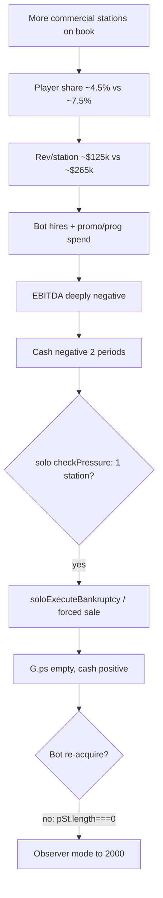

# Anchor 10 vs 16 — why player portfolios collapse

**Method:** Aggressive `runAirwaveBenchmarkPlayerBotTurn` snowball traces · 14 runs/market · SF / Seattle / Atlanta · to 2000 · seed `20260605`

**Artifact:** `tmp/anchor_collapse_10_vs_16.json`

---

## Executive summary

Anchor **16** does not “kill” players via bankruptcy flags alone. It **starves the single starter station** (lower share → lower revenue per station), the bot **overspends** (hire/promo/prog) into **deep negative EBITDA**, and solo **distress rules** (2 half-periods with cash &lt; 0 → forced sale when you only own **one** station) **liquidate the portfolio** — often by **1970–1972** (sim steps 6–7 vs 210+ at anchor 10).

After the sale, cash is often **high** ($500k–$1.8M) but the benchmark bot **never re-acquires** (`if (!pSt.length) break` in the acquisition loop), so the run continues as a **cash-rich observer** with **0 stations** — which reads as “portfolio collapse.”

---

## Economics (median)

| Metric | Anchor 10 | Anchor 16 | Δ |
| --- | ---: | ---: | --- |
| **Opening rev / station** | ~$333k | ~$198k | **−41%** |
| **Opening top share** | ~7.4% | ~4.6% | **−38% rel.** |
| **Rev / station (while operating)** | ~$265k | ~$125k | **−53%** |
| **Rev / station @ 1980** (runs still on air) | ~$295k | ~$0* | early exit |
| **Max player stations** | 1 (most runs) | 1 (most runs) | same starter |
| **Median acquisitions** | 0† | 0† | bot stops after wipe |
| **Neg-cash operating periods** | 0–1.5 | **1** | faster distress |
| **Market end-state pool** | (not captured) | (not captured) | — |

\*Anchor 16 runs overwhelmingly exit before 1980. †Survivors: anchor 10 SF ~0 acq; anchor 16 ATL survivor ~20 acq / 2 stations (1/14 runs).

**Revenue pool (passive opening-book reference, prior audit):** total commercial stations ~10 @ anchor 10 vs ~16 @ anchor 16. The **denominated pool is larger**, but the **player’s slice shrinks faster** than the pool grows (share ~7.5% → ~4.5%), so **player revenue per station** is the binding constraint.

---

## Failure cause histogram (14 runs / market)

| Cause | Anchor 10 | Anchor 16 |
| --- | --- | --- |
| **solo_distress_single_station_sale** | 14–20 total across 3 mkts | **37 / 42** |
| **survived** (still on air @ 2000) | Seattle 4, SF 12, ATL 12 | ATL **1** only |
| **bankruptcy_no_reentry** | 0 | Atlanta **4** |

**Typical collapse row (anchor 16, Seattle):** step **6**, calendar still opening era · prev period: **1 station**, rev **$115k**, EBITDA **−$95k**, cash **−$53k** → distress sale → `nStations = 0`, cash **+$694k**, `_soloBankrupt = false`.

**Typical collapse row (anchor 10, Seattle):** step **287** · prev rev **$300k**, EBITDA **−$7k**, cash **−$7k** → sale after long 1970 P1 grind.

---

## Mechanism chain (anchor 16)

1. **Share dilution** — `applyMarketOpeningShape` + more live competitors; starter is still **one** blueprint station (`under` idx 1).
2. **Revenue per station** — roughly **half** of anchor 10; same fixed talent/promo logic fights over a smaller pie.
3. **Cash flow** — bot runs **aggressive** hire (up to 2) + promo/prog + prog investment bumps; costs hit before revenue scales.
4. **Debt** — median **$0** loan principal in traces; failure is **operating cash**, not leverage.
5. **Distress** — non-campaign solo: **2** negative-cash periods (`_soloDistressExitQ = 2`) trigger sale when `G.ps.length === 1`.
6. **Acquisition activity** — **0** median because collapse happens **before** affordable second station; after wipe bot **exits acq loop** entirely.
7. **Not SF-specific** — identical cause mix in Seattle, SF, Atlanta.

---

## Anchor 10 “survivors” vs anchor 16

**Survivor pattern (e.g. SF @ 10):** one station all game, **~$302k** rev/st @ 1980, **no** distress sale, **no** acquisitions — stable but **not** leadership (#1 never held).

**Rare survivor (ATL @ 16, 1/14):** acquired **FM**, built to **2** stations, **20** acquisitions — proves anchor 16 **can** work if distress is avoided early; not representative.

---

## Answers for implementation

| Question | Answer |
| --- | --- |
| Why collapse @ 16? | **Lower rev/station + bot opex → early negative cash → single-station distress sale → no re-buy.** |
| Revenue pool? | **Larger market, smaller player share** — pool size does not help if per-station billing is halved. |
| Debt? | **Not the driver** in these traces. |
| Acquisition? | **Fails after wipe** (bot design), not because prices are unreachable. |
| SF vs peers? | **Same failure mode** — scaffold, not market patch. |

**Do not fix with SF `MARKET_BP_PATCH` first.** Fix **scaffold (16) +** either **solo distress grace for thin-share opens**, **bot re-entry when `ps.length===0`**, and/or **starter economics** tied to competitive station count.

---

*Rerun: `node scripts/diag-anchor-collapse-10-vs-16.mjs`*
