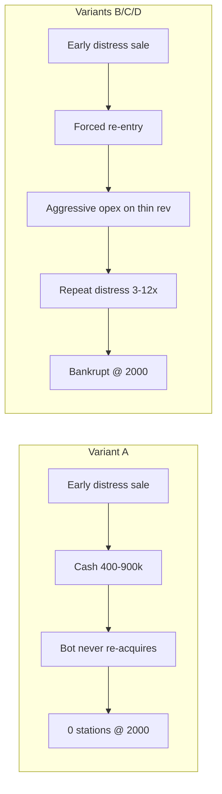

# Large-Market Survival Audit — Phase 2

**Markets:** Seattle, San Francisco, Atlanta · **1970 under** · anchors **10 & 16** · aggressive benchmark bot · **18 paired runs** / market / variant · seed `20260606`

**Artifacts:** `tmp/large_market_survival_phase2.json` · `scripts/diag-large-market-survival-phase2.mjs`

---

## Variants

| Variant | Behavior |
| --- | --- |
| **A** | Production bot (control) — exits acquisition loop when `ps.length === 0` |
| **B** | After distress sale: re-enter when `cash >= cheapest station` (game threshold); re-entry after `advTurn` + end of bot turn |
| **C** | B + 10 operating periods with solo distress counter suppressed after each re-entry |
| **D** | B + re-entry at start/end of bot turn + acquisition loop continues when empty |

---

## Survival to 2000 (≥1 station, not `_soloBankrupt`)

| Anchor | Market | A | B | C | D |
| ---: | --- | ---: | ---: | ---: | ---: |
| 10 | seattle | 38.9% | 38.9% | 38.9% | 38.9% |
| 10 | sanfrancisco | 94.4% | 94.4% | 94.4% | 94.4% |
| 10 | atlanta | 94.4% | 94.4% | 94.4% | 94.4% |
| 16 | seattle | 0.0% | 0.0% | 0.0% | 0.0% |
| 16 | sanfrancisco | 0.0% | 0.0% | 0.0% | 0.0% |
| 16 | atlanta | 0.0% | 0.0% | 0.0% | 0.0% |
| **10** | **pooled** | **75.9%** | — | — | — |
| **16** | **pooled** | **0.0%** | **0.0%** | **0.0%** | **0.0%** |

**Anchor 10:** Re-entry variants do not change survival (most survivors never liquidate; Seattle failures are economic, not bot-observer).

**Anchor 16:** Re-entry variants **never** produce 2000 survival in any market.

---

## Anchor 16 pooled — median metrics

| Variant | Rev/st (op.) | EBITDA/st | Peak share | Acquisitions | Distress periods | Re-entries | Zero-st periods | Cash @2000 | End state |
| --- | ---: | ---: | ---: | ---: | ---: | ---: | ---: | ---: | --- |
| **A** | $121k | −$71k | 4.57% | 0 | **1** | 0 | 62 | **$592k** | 48/54 **observer** (cash, 0 st) |
| **B** | $112k | −$84k | 4.57% | 0 | **4** | **1** | 62 | **$0** | 54/54 **bankrupt** |
| **C** | $24k | −$105k | 4.57% | 0 | **12** | **1** | 68 | **$0** | 54/54 **bankrupt** |
| **D** | $112k | −$84k | 4.57% | 0 | **4** | **1** | 62 | **$0** | 54/54 **bankrupt** |

**Operating periods (median):** A ~5 before first wipe; B/C/D ~6–11 after re-entry then terminal bankruptcy.

---

## Attribution — anchor 16 (pooled, 54 runs)

### Control A — two failure modes

1. **Bot-gap observer (48/54 = 88.9%)**  
   First solo distress sale → `ps = []`, cash **$450k–$915k**, `canAffordReentry`, **not** `_soloBankrupt`. Production bot never buys back in.

2. **Economic bankruptcy without observer cushion (6/54 = 11.1%)**  
   `_soloBankrupt` at end; little or no re-entry capital (Atlanta-weighted in prior audits).

### B / C / D — bot gap closed, economics dominate

- **48/54 (88.9%)** execute **≥1 re-entry** on the same seed as A.
- **0/54** survive to 2000 on any variant.
- Failure becomes **repeat distress** (median **4** distress-tagged periods under B/D; **12** under C) → cash depleted → **`_soloBankrupt`**.
- Same aggressive hire/promo/prog on **~$100k–$120k** rev/st → **−$70k–$105k** EBITDA/st.

---

## Answers to the three questions

### 1. What percentage of Anchor 16 failure is caused by economics?

**Depends on the endpoint:**

| Question | Estimate |
| --- | --- |
| **Why control A ends with 0 stations @ 2000** | **~89% bot behavior** (observer with re-entry capital), **~11% economics** (bankrupt, no capital) |
| **Why no run sustains to 2000 once re-entry is enabled** | **~100% economics** — B/C/D all 0% survival; re-entry only postpones the same thin-revenue / high-opex spiral |

Thin share (~4.5% peak), ~half the rev/station of anchor 10, and aggressive bot spend are sufficient to re-trigger distress after re-entry without any SF-specific patch.

### 2. What percentage is caused by the benchmark bot exiting after the first forced sale?

**~89% of anchor 16 control runs** (48/54) match **permanent bot exit after first sale**: distress once, cash-rich observer, zero re-entries.

**0%** of those runs become 2000 survivors when re-entry is forced (B/C/D on paired seeds) — so the bot explains **the terminal portfolio shape in A**, not the **underlying inability to operate profitably** at anchor 16.

### 3. Does Anchor 16 still require economic tuning after re-entry is enabled?

**Yes.** With re-entry + max bot assist (D), survival stays **0%** vs **75.9%** at anchor 10 control. Distress grace (C) **increases** distress cycles and **lowers** rev/st — it does not help.

**Is anchor 16 “reasonably survivable” if the bot re-enters?** **No** in this harness — not SF-specific; identical across Seattle, SF, Atlanta.

---

## Interpretation (no fixes proposed)

Phase 2 separates:

- **Benchmark artifact:** Production bot treats post-liquidation capital as game-over for acquisitions (~89% of A@16 outcomes).
- **Structural economics:** Even immediate re-entry at game affordance thresholds cannot keep a station alive through 2000 under the same aggressive bot and solo distress rules.

Tuning startup cash, distress thresholds, acquisition logic, or market economics should be informed by the **B/C/D floor** (0% survival), not by control-A observer rates alone.

*Rerun:* `node scripts/diag-large-market-survival-phase2.mjs`
